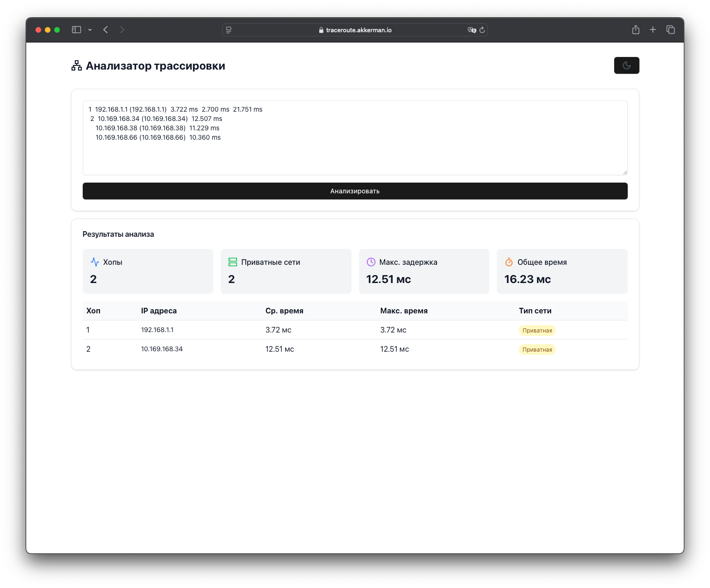

# Анализатор трассировки маршрутов ☝️

## Описание
Веб-приложение для анализа и визуализации данных трассировки маршрутов (traceroute). Инструмент позволяет быстро преобразовать текстовый вывод команды traceroute в интерактивный и информативный отчет.

## Возможности
- Парсинг данных трассировки с автоматическим распознаванием IP-адресов и времени отклика
- Анализ типов сетей (приватные/публичные)
- Расчет статистических показателей:
  - Общее количество хопов
  - Количество приватных сетей
  - Максимальная задержка
  - Суммарное время трассировки
- Интерактивная таблица с детальной информацией о каждом хопе
- Поддержка светлой и темной темы
- Адаптивный дизайн

## Технологии
- React
- Vite
- Tailwind CSS
- Shadcn/ui компоненты
- Lucide иконки

## Установка и запуск

### Требования
- Node.js версии 18 или выше
- npm

### Локальная установка
Клонируйте репозиторий:
```bash
git clone [URL репозитория]
cd traceroute-analyzer
```

Установите зависимости:
```bash
npm install
```

Запустите проект в режиме разработки:
```bash
npm run dev
```

Откройте http://localhost:5173 в браузере

### Сборка проекта
Для создания производственной сборки:
```bash
npm run build
```

## Использование
1. Вставьте вывод команды traceroute в текстовое поле
2. Нажмите кнопку "Анализировать"

## Пример входных данных
```
 1  192.168.1.1 (192.168.1.1)  3.722 ms  2.700 ms  21.751 ms
 2  10.169.168.34 (10.169.168.34)  12.507 ms
    10.169.168.38 (10.169.168.38)  11.229 ms
    10.169.168.66 (10.169.168.66)  10.360 ms
```

## Лицензия
MIT

## Автор
[Ivan Akkerman]

## Содействие
Если вы хотите внести свой вклад в проект:
1. Форкните репозиторий
2. Создайте ветку с новой функциональностью
3. Отправьте пулл-реквест

## Планы по развитию
- Добавление визуализации маршрута на карте
- Экспорт результатов анализа
- Сохранение истории анализов
- Поддержка различных форматов вывода traceroute